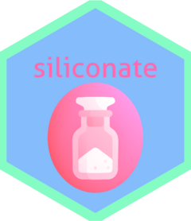

<!-- README.md is generated from README.Rmd. Please edit that file -->

# siliconate <a href='https://paithiov909.github.io/siliconate'></a>

<!-- badges: start -->
<!-- badges: end -->

## Usage

### Lorem ipsum

This is a mimic of nanoid.

``` r
siliconate::nano(3L, hana)
#> [1] "内供は人を見ずに、ただ、鼻を見た。内供は、いつものように、鼻などは気にかけないと云う風をして、わざとその法もすぐにやって見ようとは云わずにいた。そこで内供は、積極的にも消極的にも、この自尊心の毀損を恢復しようと試みた。"
```

### Execute silicon

``` r
reprex::reprex({
  ## > Run a bit of R code using rmarkdown::render() and write the rendered result to user's clipboard.
  x <- 1:4
  y <- 2:5
  x + y
}, venue = "R", html_preview = FALSE)

siliconate::silicon() ## Call silicon command. By default, the image just goes to clipboard.
```

Then you can paste and save the image like this.


## License

MIT license. Icons made by [Freepik](https://www.freepik.com) from
[www.flaticon.com](https://www.flaticon.com/).
